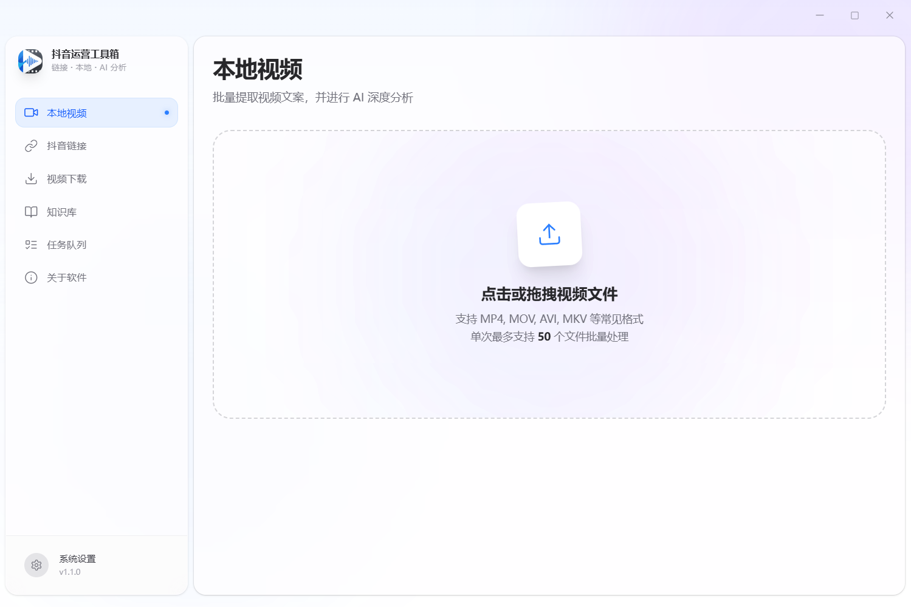
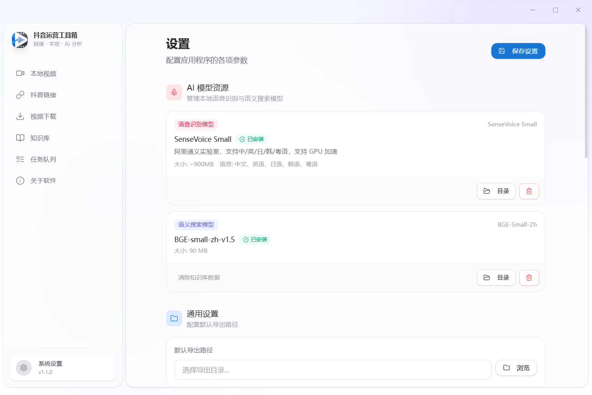
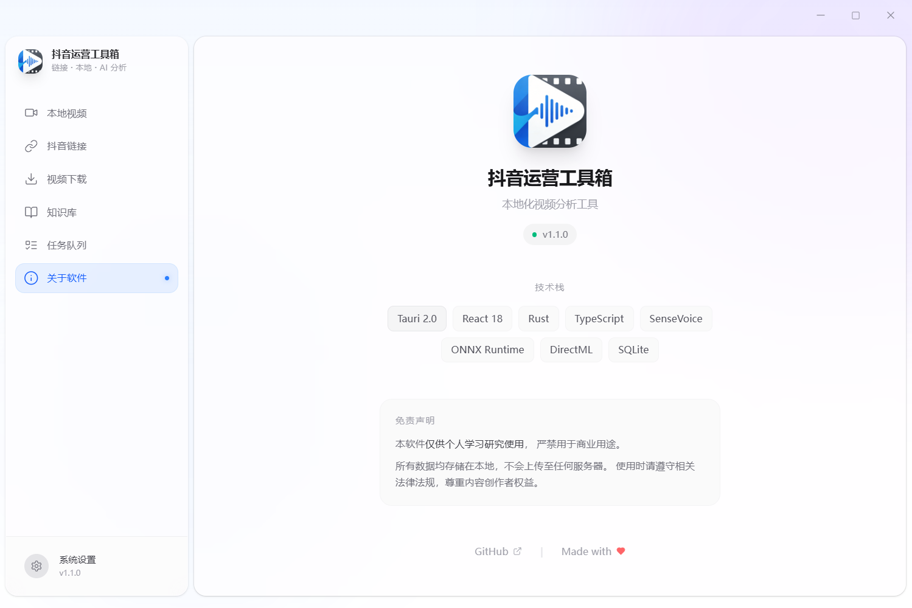

# 抖音运营工具箱 v1.2.0

<p align="center">
  <strong>本地批量转写、抖音链接提取、AI 分析、私有知识库、创作 Agent 一体化桌面工具</strong>
</p>

<p align="center">
  
  
  
  
  
</p>

---

## 项目简介

这是一个面向抖音内容创作场景的 Windows 桌面工具，核心目标是把“素材采集 -> 文案提取 -> AI 分析 -> 知识库增强 -> Agent 生成内容”串成一条本地化工作流。

项目当前以 Tauri 2 + React + Rust 为主框架，语音转写依赖本地 ASR 能力，AI 能力支持豆包、OpenAI、DeepSeek、LM Studio，多数核心数据默认保存在本机。

---

## v1.2.0 更新重点

- 新增 `Agent Studio`，把转写结果、知识库与 AI 分析串联成抖音创作 Agent 工作台
- 内置 10 个创作 Skill，覆盖脚本生成、热点选题、去 AI 味、复盘优化、评论转化等场景
- GPU 配置入口恢复可用，并统一打通到本地转写与抖音链接转写链路
- 知识库导入持久化修复，导入内容重启后不再丢失
- API Key 改为 Windows DPAPI 本机加密存储，降低明文落库风险
- 新增可分发运行时整理脚本，统一打包 `python-embed`、`FFmpeg`、GPU 相关 DLL 与运行时清单
- 全项目版本号统一升级为 `v1.2.0`，安装包产物同步更新

---

## 功能亮点

| 功能 | 说明 |
|------|------|
| 本地视频批量转写 | 支持批量导入本地视频，单次最多 50 个，提取视频文案并导出 |
| 抖音链接批量提取 | 粘贴抖音分享链接，自动解析标题、作者、统计信息和视频文案 |
| 批量无水印下载 | 针对抖音链接批量下载视频，并提供下载进度与失败重试 |
| AI 深度分析 | 对视频结构做拆解，输出开头钩子、高潮包袱、结尾引导等信息 |
| 全库 AI 对话 | 对单条文案或全部已转写内容发起 AI 对话，总结爆款规律 |
| 私有知识库 | 导入行业资料，支持语义检索，为生成结果提供知识增强 |
| Agent Studio | 选择 Skill、输入任务、挂载知识库，生成结构化创作结果 |
| GPU 加速 | 支持 NVIDIA CUDA 场景的检测、选择与加速转写 |
| 本地优先 | 桌面端运行，配置、任务、知识库默认保存在本机 |

---

## 内置 Agent Skills

v1.2.0 内置了 10 个可直接使用的抖音创作 Skill：

- 短视频脚本 Agent
- 抖音热点 Agent
- 去 AI 味 Agent
- 复盘优化 Agent
- 钩子生成 Agent
- 竞品模式拆解 Agent
- 知识库增强脚本 Agent
- 账号定位 Agent
- 内容矩阵扩展 Agent
- 评论转化回复 Agent

这些 Skill 存放在 `src-tauri/resources/agent/skills.json`，后续你可以继续扩展成自己的私有技能库。

---

## 界面预览

| 首页 | 设置页面 | 关于软件 |
|:---:|:---:|:---:|
|  |  |  |

---

## 安装与部署

### 方式一：直接使用安装包

如果你已经完成打包，可直接分发以下安装包：

- `抖音运营工具箱_1.2.0_x64-setup.exe`

如果你要在 README 中放压缩包下载，也请同步使用：

- `抖音运营工具箱_1.2.0.zip`

GitHub Releases：

- [https://github.com/lid664951-crypto/douyin-creator-toolkit/releases](https://github.com/lid664951-crypto/douyin-creator-toolkit/releases)

### 方式二：从源码构建

#### 环境要求

- Windows 10/11 x64
- Node.js 18+
- Rust Stable
- PowerShell 5.1+
- Visual Studio C++ Build Tools
- Git

#### 安装依赖

```bash
git clone https://github.com/lid664951-crypto/douyin-creator-toolkit.git
cd douyin-creator-toolkit
corepack enable
corepack pnpm install
```

#### 准备可分发运行时资源

在执行 Tauri 打包前，先运行：

```powershell
powershell -ExecutionPolicy Bypass -File "./src-tauri/scripts/prepare_runtime.ps1"
```

运行真实本地视频 smoke 前，可以先检查开发机上的 FFmpeg 运行时是否齐全：

```bash
corepack pnpm doctor:ffmpeg
```

这个检查要求 `src-tauri/resources/ffmpeg` 下同时存在：

- `ffmpeg.exe`
- `ffprobe.exe`

这个脚本会完成以下工作：

- 下载并整理 `python-embed` 到 `src-tauri/resources/python-embed`
- 下载并整理 `ffmpeg` / `ffprobe` 到 `src-tauri/resources/ffmpeg`
- 同步 GPU ASR 所需 DLL 到 `src-tauri/resources/bin`
- 生成 `src-tauri/resources/runtime-manifest.json`

#### 开发模式运行

```bash
corepack pnpm tauri dev
```

#### 构建生产安装包

```bash
corepack pnpm build
corepack pnpm tauri build
```

---

## 首次使用建议

首次启动后，建议按下面顺序完成初始化：

1. 打开“设置”页面，确认默认导出目录
2. 下载 ASR 模型，保证本地转写和链接转写可用
3. 如果要使用知识库语义检索，再下载知识库嵌入模型
4. 配置 AI 提供者：豆包 / OpenAI / DeepSeek / LM Studio
5. 如需 GPU 加速，在设置页检测显卡并选择对应设备
6. 导入你的行业资料到知识库，再进入 `Agent Studio` 组合使用

---

## Agent Studio 工作流

`Agent Studio` 是 v1.2.0 的核心新增能力，当前定位是“抖音创作工作流 Agent MVP”。

典型使用方式：

1. 在“本地视频”或“抖音链接”页面先拿到转写结果
2. 通过“发送到 Agent”把转写内容和结构分析草稿带入 Agent Studio
3. 选择适合的 Skill，例如“短视频脚本 Agent”或“去 AI 味 Agent”
4. 按需启用知识库增强，让 Agent 先检索私有资料
5. 输出结构化结果，用于脚本定稿、热点拆解或账号运营优化

这套能力适合继续往“专属创作 Agent”方向演进，当前版本已经具备 MVP 形态。

---

## 可分发运行时结构

当前打包资源已经整理为统一结构：

```text
src-tauri/resources/
|- agent/
|  `- skills.json
|- bin/
|  |- DirectML.dll
|  |- onnxruntime.dll
|  `- sherpa-onnx-*.dll
|- dy-mcp/
|- ffmpeg/
|  |- ffmpeg.exe
|  `- ffprobe.exe
|- python-embed/
`- runtime-manifest.json
```

这样做的目的，是让安装包具备更稳定的“真正可分发”结构，而不是依赖开发机本地环境。

---

## 技术栈

- 前端：React 19 + TypeScript + Vite + Zustand + Tailwind CSS
- 桌面壳：Tauri 2
- 后端：Rust + Tokio + SQLite
- 语音识别：Python Sidecar + sherpa-onnx + SenseVoice
- AI 服务：豆包 / OpenAI / DeepSeek / LM Studio
- 知识库：SQLite + 向量检索 + ONNX Embedding
- 打包分发：NSIS + Tauri Bundle

---

## 常见问题

### 1. 为什么第一次启动会比较慢？

首次使用通常要初始化数据库、模型状态以及本地运行时资源；如果还没有下载 ASR/知识库模型，相关功能会提示先完成准备。

### 2. GPU 加速为什么没有生效？

目前主要面向已安装 CUDA 环境的 NVIDIA 显卡。请先在设置页完成 GPU 检测，并确认本机驱动、CUDA 和模型兼容。

### 3. 安装包是否依赖本机 Python 或 FFmpeg？

v1.2.0 之后的分发方案已经支持把 `python-embed`、`FFmpeg` 和必要 DLL 打进资源目录，目标是尽量减少对用户机器环境的额外依赖。

### 4. API Key 是否还是明文存储？

在 Windows 平台，当前版本已改为基于 DPAPI 的本机加密存储，不再直接以明文写入配置值。

### 5. 现在的 Agent 是不是通用智能体？

还不是。当前更准确的定位是“面向抖音创作工作流的垂直 Agent MVP”，重点是把你现有能力模块化、技能化、可编排化。

---

## 开发说明

如果你后续继续扩展这个项目，建议优先沿这几个方向迭代：

- 让 Agent 支持多步骤编排，而不是单次 Skill 调用
- 把 Skill 从静态 JSON 扩展成可导入、可版本化、可热更新
- 为知识库检索、转写结果、Agent 输出建立统一任务编排与审计日志
- 把抖音热点、竞品拆解、脚本生成进一步串成自动化工作流

---

## 免责声明

本项目仅供个人学习、研究与内容工作流探索使用，请遵守相关法律法规与平台规则，尊重原作者和内容版权。

---

## License

本项目基于 [MIT License](./LICENSE) 开源。
